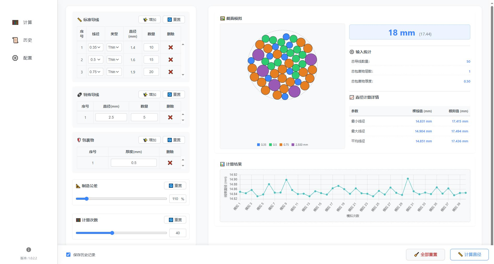

# 线束直径计算工具 (Wire Bundle Diameter Calculator)

[](https://microsoftedge.microsoft.com/addons/detail/线束直径计算器/dcinhgdofeolfogjefdocphbnmdicopj)
[](https://addons.mozilla.org/firefox/addon/wirebundle/)
[](LICENSE)

## 📝 项目简介

本工具是一款基于二维圆形填充算法的线束直径估算插件。它可以帮助你根据输入的多种规格导线、包裹物层数和厚度，通过模拟计算来估算线束的最终直径，并提供可视化结果和配置管理功能。现已支持Chrome/Edge和Firefox浏览器。



---

## ✨ 主要功能

- **多规格导线支持**：支持标准导线（多种线规/壁厚类型）、特殊导线（自定义直径）、数量灵活配置
- **包裹物层管理**：支持多层包裹物（如胶带、波纹管），厚度可自定义
- **制造公差调整**：可设置制造公差百分比，模拟实际生产偏差
- **蒙特卡洛模拟**：多次随机堆叠模拟，统计最小/最大/平均直径
- **可视化展示**：自动生成线束截面图、直径分布折线图、图例
- **历史记录与导出**：自动保存每次计算参数与结果，支持导出 CSV
- **参数配置**：可自定义标准导线库，适应企业/个人特殊需求
- **多语言支持**：内置中文和英文界面

---

## 🖥️ 界面概览

- **左侧导航栏**：  
  - 🧮 计算：主功能页面，输入参数并执行模拟计算  
  - 📜 历史：查看和导出历史计算记录  
  - ⚙️ 配置：自定义标准导线参数  
  - 版本号与侧边栏收起/展开按钮

- **主内容区**（以"计算"页面为例）：  
  - 标准导线、特殊导线、包裹物输入表格  
  - 制造公差、计算次数滑块  
  - 计算按钮、重置按钮、保存历史选项  
  - 右侧为截面模拟图、直径统计表、分布折线图等

---

## 🚀 快速上手

### 1. 安装扩展

#### Edge/Chrome版本
- 推荐：从 [Microsoft Edge 应用商店](https://microsoftedge.microsoft.com/addons/detail/线束直径计算器/dcinhgdofeolfogjefdocphbnmdicopj) 一键安装
- 或：下载本仓库代码，开发者模式加载（edge://extensions/ → 加载已解压的扩展）

#### Firefox版本
- 推荐：从 [Firefox Add-ons](https://addons.mozilla.org/firefox/addon/wirebundle/) 安装
- 或：下载本仓库代码，使用以下步骤加载：
  1. 在地址栏输入：`about:debugging`
  2. 点击"此 Firefox"（This Firefox）
  3. 点击"临时载入附加组件"（Load Temporary Add-on）
  4. 选择扩展目录中的manifest.json文件

### 2. 计算流程示例

1. 点击浏览器工具栏中的扩展图标，弹出主界面
2. 在"标准导线"区域，选择线规、类型，输入数量
3. 如有特殊导线，在"特殊导线"区域输入直径和数量
4. 在"包裹物"区域添加包裹层及厚度
5. 调整制造公差和计算次数（可选）
6. 点击"计算直径"按钮或直接按 Enter 键
7. 查看右侧模拟图、直径统计和分布图
8. 勾选"保存历史记录"可自动归档本次计算

---

## 📊 主要界面说明

- **标准导线**：下拉选择线规和类型，自动填充直径，输入数量即可
- **特殊导线**：直接输入外径和数量，适合非标线材
- **包裹物**：每层单独输入厚度，可多层叠加
- **制造公差**：通过滑块或输入百分比调整
- **计算次数**：决定模拟精度，次数越多结果越稳定
- **结果区**：显示模拟截面图、最终直径、详细统计和分布折线图
- **历史记录**：可导出为 CSV，支持一键清空
- **配置页面**：自定义标准导线库，支持本地保存和恢复默认

---

## 🛠️ 技术栈

- HTML5 + CSS3
- JavaScript (ES6+)
- 浏览器扩展API（Chrome/Edge & Firefox）
- Canvas API（可视化）
- 本地存储（localStorage）

---

## 📁 项目结构

```
├── _locales/           # 国际化资源
│   ├── zh_CN/         # 中文语言包
│   └── en/            # 英文语言包
├── icons/             # 扩展图标
├── src/               # 源代码
│   ├── assets/        # 截图与图片
│   ├── components/    # UI组件
│   ├── logic/         # 业务逻辑
│   ├── pages/         # 页面
│   ├── utils/         # 工具函数
│   │   └── browserPolyfill.js  # 浏览器兼容层
│   └── storage/       # 数据存储
├── manifest.chrome.json   # Chrome/Edge扩展配置
├── manifest.firefox.json  # Firefox扩展配置
├── build.bat          # 构建脚本
├── popup.html         # 主界面
└── README.md          # 项目说明
```

---

## 🔧 开发指南

### 构建不同版本

项目提供了构建脚本用于生成不同浏览器的版本：

1. Chrome/Edge版本构建：
```powershell
.\build.bat chrome
```

2. Firefox版本构建：
```powershell
.\build.bat firefox
```

### 开发注意事项

1. 浏览器API调用：
   - 使用 `src/utils/browserPolyfill.js` 中的统一接口
   - 不要直接调用 `chrome` 或 `browser` 对象
   - 所有API调用都通过 `browserAPI` 对象进行

2. manifest文件：
   - `manifest.chrome.json`: Chrome/Edge版本配置（V3）
   - `manifest.firefox.json`: Firefox版本配置（V2）
   - 构建时会自动选择对应版本

---

## ❓ 常见问题（FAQ）

- **Q: 为什么有些线径没有"超薄壁"选项？**  
  A: 只有标准库中定义了"Ultra Thin"类型的线规才会显示该选项，若无数据则不显示。

- **Q: 为什么直接打开 popup.html 会报 CORS 错误？**  
  A: 请务必通过浏览器扩展方式加载和启动，不能直接用 file:// 协议打开 HTML 文件。

- **Q: 历史记录/自定义配置会丢失吗？**  
  A: 所有数据均保存在本地浏览器，清除浏览器数据或更换设备会导致数据丢失。

- **Q: 如何反馈问题或建议？**  
  A: 请通过 GitHub Issue 或邮件联系作者。

- **Q: 不同浏览器版本有功能差异吗？**  
  A: 不同浏览器版本的功能完全一致，仅在底层实现上有所不同以适配各浏览器的特性。

- **Q: 为什么有两个manifest文件？**  
  A: 由于Chrome和Firefox的扩展规范有所不同，需要分别维护两个配置文件。使用构建脚本可以自动选择正确的配置文件。

---

## 🤝 贡献指南

欢迎提交 Issue 和 Pull Request 来帮助改进本项目。请确保代码规范、注释清晰，并附带必要的说明。

---

## 📄 许可证

本项目采用 MIT 许可证 - 详见 [LICENSE](LICENSE) 文件

---

## 👥 作者

- C3604 - [GitHub](https://github.com/C3604)

---

## 📞 联系方式

- 提交 [Issue](https://github.com/C3604/Wire-Bundle-Diameter-Calculation/issues)

---

如果这个工具对您有帮助，欢迎给个 ⭐️ 支持一下！ 