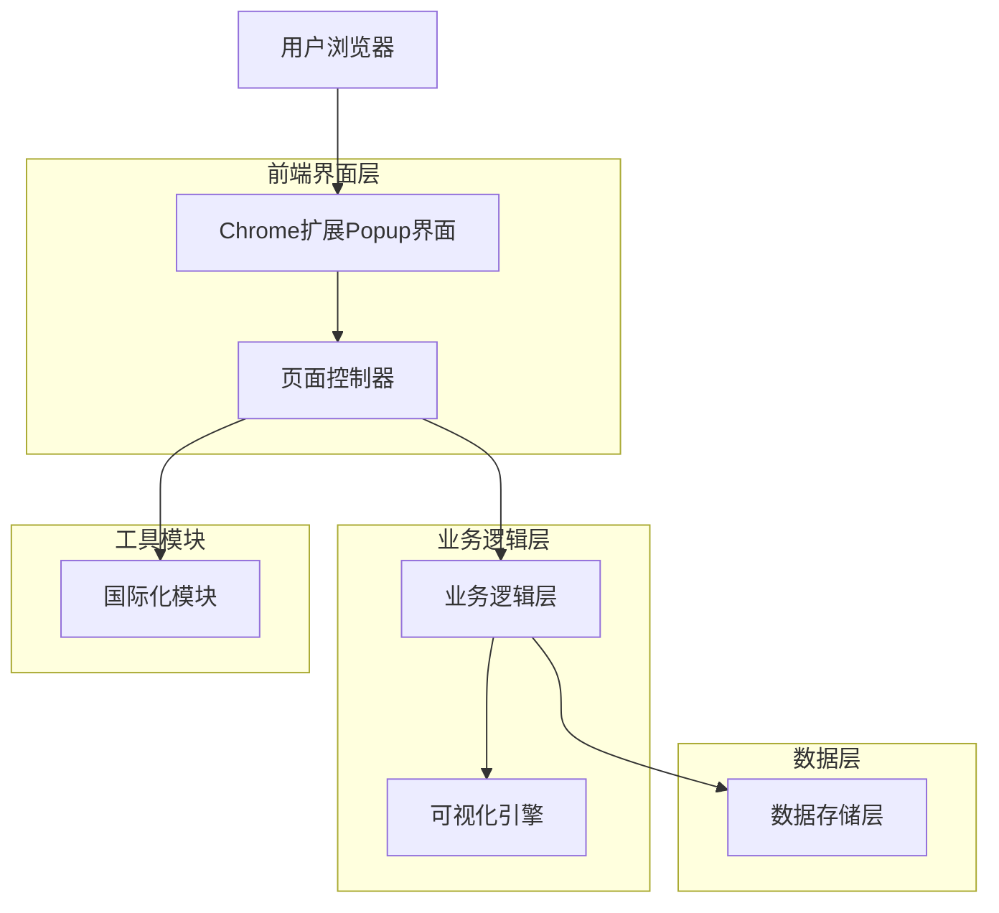
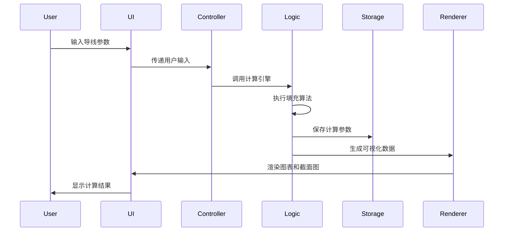

# 技术架构文档

## 1. 架构设计

### 系统架构图


### 模块交互流程


## 2. 技术描述

### 核心技术栈
- **前端框架**: 原生JavaScript (ES6+)
- **UI技术**: HTML5 + CSS3
- **图形渲染**: Canvas API
- **数据存储**: Chrome Storage API
- **国际化**: 自定义i18n模块
- **扩展架构**: Chrome Extension Manifest V3

### 关键依赖
- **Chart.js**: 图表绘制库 (vendor/chart.umd.js)
- **html2canvas**: 截图导出功能 (vendor/html2canvas.min.js)

### 开发环境
- **代码编辑器**: VS Code (推荐)
- **浏览器**: Microsoft Edge 或 Google Chrome
- **调试工具**: Chrome DevTools

## 3. 核心模块设计

### 3.1 业务逻辑层 (src/logic/)

#### simulationEngine.js
- **功能**: 核心计算引擎，实现二维圆形填充算法
- **算法**: 蒙特卡洛模拟 + 物理碰撞检测
- **输入**: 导线参数、模拟次数、公差设置
- **输出**: 最优排列方案、直径统计结果

#### wireManager.js
- **功能**: 导线数据管理
- **职责**: 
  - 标准导线规格维护
  - 自定义导线验证
  - 导线类型转换

#### simulationConstants.js
- **功能**: 定义计算常量
- **内容**: 精度设置、默认参数、算法阈值

### 3.2 可视化引擎 (src/components/)

#### simulationRenderer.js
- **功能**: 截面图渲染
- **技术**: Canvas 2D API
- **特性**: 
  - 实时渲染导线排列
  - 颜色编码区分导线类型
  - 支持缩放和平移

#### chartRenderer.js
- **功能**: 统计图表生成
- **图表类型**: 直方图、折线图
- **数据源**: 蒙特卡洛模拟结果

### 3.3 数据管理层 (src/services/, src/storage/)

#### storage.js
- **功能**: Chrome Storage API封装
- **操作**: 读取、写入、删除、监听
- **数据类型**: 配置数据、历史记录

#### standardWires.js
- **功能**: 标准导线数据库
- **格式**: JSON结构化数据
- **维护**: 支持用户自定义扩展

### 3.4 国际化模块 (src/i18n/)

#### index.js
- **功能**: 多语言支持
- **实现**: 基于Chrome i18n API
- **语言**: 简体中文、英文
- **特性**: 运行时语言切换

## 4. 数据流设计

### 4.1 计算数据流
```
用户输入 → 参数验证 → 计算引擎 → 结果存储 → 界面更新
    ↓           ↓           ↓           ↓           ↓
  导线规格    数据清洗    算法执行    本地存储    图表渲染
```

### 4.2 配置数据流
```
配置修改 → 本地验证 → 存储更新 → 界面同步 → 下次加载
    ↓           ↓           ↓           ↓           ↓
  用户设置    格式检查    Chrome存储  实时反馈    持久化配置
```

## 5. 性能优化策略

### 5.1 算法优化
- **空间分割**: 使用网格加速碰撞检测
- **增量计算**: 只重计算变化的部分
- **缓存机制**: 缓存中间计算结果

### 5.2 渲染优化
- **脏矩形**: 只重绘变化区域
- **离屏渲染**: 预渲染复杂图形
- **防抖节流**: 控制高频更新

### 5.3 存储优化
- **数据压缩**: 减少存储空间
- **懒加载**: 按需加载历史数据
- **过期清理**: 自动清理过期记录

## 6. 错误处理机制

### 6.1 输入验证
- **格式检查**: 验证输入数据格式
- **范围限制**: 检查数值合理性
- **类型转换**: 安全的数据类型转换

### 6.2 异常捕获
- **try-catch**: 关键代码块异常捕获
- **错误日志**: 记录错误信息
- **用户提示**: 友好的错误提示

### 6.3 降级处理
- **默认值**: 异常时使用默认值
- **缓存回退**: 使用上次成功结果
- **离线模式**: 基础功能离线可用

## 7. 安全考虑

### 7.1 数据安全
- **本地存储**: 所有数据本地处理，不上传服务器
- **输入净化**: 防止XSS攻击
- **权限最小**: 仅申请必要权限

### 7.2 代码安全
- **严格模式**: 使用JavaScript严格模式
- **依赖审查**: 第三方库安全审查
- **更新机制**: 及时更新安全补丁

## 8. 扩展性设计

### 8.1 模块化架构
- **高内聚**: 模块功能单一明确
- **低耦合**: 模块间依赖最小化
- **接口清晰**: 定义明确的模块接口

### 8.2 插件机制
- **钩子系统**: 预留扩展点
- **配置驱动**: 通过配置扩展功能
- **热插拔**: 支持运行时加载

### 8.3 数据格式
- **向前兼容**: 数据格式支持版本升级
- **开放标准**: 使用通用数据格式
- **文档完整**: 详细的数据格式文档
